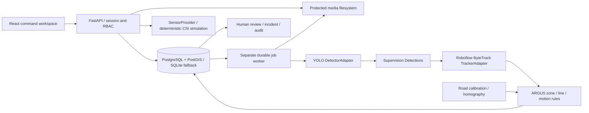

# ARGUS local MVP architecture

The original requirements remain untouched in `../Documntation/`. Their order of precedence is sprint plan → SRS → architecture → user stories → use cases. The master prompt narrows live ingestion to uploads and replaces the Sense placeholder with deterministic simulation.

## Components

`backend/argus/vision.py` owns detector and tracker adapters. ByteTrack comes from the independently maintained `trackers` package, not deprecated Supervision tracking APIs. `supervision.Detections`, `BoxAnnotator` and `LabelAnnotator` normalize/render results. ARGUS owns the geometry rules, motion thresholds, events and workflow. Shapely validates polygons and finite line intersections.

`backend/argus/worker.py` claims queued jobs using a conditional database update. It persists progress per sampled frame, samples according to source FPS, and preserves source frame timestamps. It writes JSONL observations and JPEG event snapshots; no raw video frames enter the relational database. Browser overlays read at most 120 seconds of observations per request. Observations currently use a sequential file scan; time-indexed chunking is a scaling follow-up.

The worker records model path, SHA-256, version, device, confidence, processing FPS and a complete geometry snapshot per job. Editing a zone does not mutate earlier event evidence. Run analysis again after changing rules. Temporary IDs are scoped to an analysis; they cannot identify people or link objects across videos. Unconfirmed tracker IDs are excluded from analytics. Track loss is explicit; no extrapolated detection is presented as observed.

Original media is retained. After inference, bundled FFmpeg creates browser-compatible H.264 playback. Overlay coordinates are normalized to original dimensions. Snapshots use annotated original-resolution frames. Job errors remain FAILED; the worker does not fabricate fallback detections. A worker restart marks jobs stale after five minutes as FAILED instead of duplicating a partially completed result.

## Rule semantics

- Anchor: bottom-center of the observed bounding box.
- Restricted entry: a currently observed track enters the configured polygon.
- Crowd: occupancy transitions NORMAL / ELEVATED / HIGH / CRITICAL at `elevated_ratio`× / 1× / `critical_ratio`× the configurable high threshold (defaults 0.8 and 1.25, set per zone). Returning to NORMAL also records a transition.
- Dwell: continuous observed membership; missing membership resets dwell conservatively.
- Line: movement intersects the finite line and changes side. Samples exactly on the line retain the last nonzero side; a 0.5-second debounce limits jitter. IN is the positive side of the first-to-second endpoint vector.
- Stopped: displacement remains within a configurable normalized radius for the configured seconds. This differs from merely remaining in a zone. It is not physical speed.
- Calibration: an operator draws four corners of a road rectangle and enters its measured width and length. `backend/argus/physical.py` solves the homography from frame coordinates to metres on that plane. One calibration per camera view; without it no speed or distance is reported.
- Speed: only for vehicles whose anchor lies inside the calibrated area. A least-squares fit over a short sliding window (at least three samples spanning 0.4 s) gives ground velocity. History restarts after a sampling gap or a jump implying more than 250 km/h, so an ID switch yields no speed rather than a spike. Accuracy depends on the operator's measurements, a fixed camera and a flat road, and degrades with distance from the camera.
- Speeding: a zone with a `speed_limit_kmh` above zero raises one event per vehicle per visit, after two consecutive over-limit estimates.
- Traffic: vehicle count inside configured Traffic Zones and Lanes (or the whole frame if absent); FREE FLOW / MODERATE / HEAVY / CONGESTED at 0.4× / 0.75× / 1× the configured count threshold. With a calibration and at least three measured vehicles, the median speed gives a second state at 0.7 / 0.45 / 0.25× the configured free-flow speed, and the worse of the two is reported; `traffic_basis` says which inputs were used. Zones and lines also report hourly flow extrapolated from arrivals in the last five minutes and the average measured speed.
- Convoy: operator designates a visible vehicle, by video timestamp on a recording or in the running session on a camera. Context contains actual position, direction, observed duration, sample continuity and nearby track IDs within 0.25 normalized frame units. Delay rules evaluate saved observations from designation onward; a stopped designated track or configured congestion produces an event. An optional operator-drawn route yields progress as the projection of the vehicle anchor onto that polyline divided by its length (frame coordinates; vehicles beyond 0.08 units are outside tolerance). With a calibration, the route is mapped to metres and the convoy also reports distance along the route, remaining distance, spacing between consecutive vehicles, the time each needs to close that gap, convoy length, and an arrival estimate from the lead vehicle's speed. The operational timeline records designations, loss after 1.5 s unobserved, reacquisition, and traffic-state changes held for two samples. No threat interpretation.

## Storage and authorization

SQLAlchemy models cover users, sessions, persisted role permissions, model registry, videos, jobs, geometries, tracks, events, incidents, audit, worker heartbeats and simulation sessions. A unique incident/event relationship prevents duplicate conversion. PostgreSQL uses row locks for review/conversion; SQLite provides a local single-writer fallback. PostGIS is installed by migrations; the basic map stores operator-supplied coordinates as JSON and performs no GIS spatial queries yet.

Session cookies are HttpOnly, SameSite=Strict and expire server-side. Set COOKIE_SECURE=true behind HTTPS. Tokens are stored hashed; passwords use Argon2. Mutations require a same-origin custom header; there is no permissive CORS configuration. Login attempts are throttled and audited. APIs enforce permissions and do not expose filesystem paths for evidence. Filenames are replaced by generated IDs. File size, extension, MIME and actual decode validity are checked. Admin model registration accepts existing approved local files only; model weights are not accepted through the video upload route.

Audit is append-only through the API; it is not cryptographically tamper-evident against a database administrator. Roles are functional at application level; organization/site/camera row-level isolation is a Phase 2 requirement.

## Research foundations

- [Roboflow Supervision](https://github.com/roboflow/supervision): reusable detector representation and annotation primitives; MIT license.
- [Roboflow Trackers](https://github.com/roboflow/trackers): independent multi-object tracking adapters; Apache-2.0.
- [WiFi DensePose](https://github.com/ljq/wifi-densepose): reviewed its CSI acquisition → signal processing → observation/pose architecture and amplitude/phase representation. ARGUS copies no sensing claims and imports no hardware pipeline. Its normalized provider separates synthetic room observations from a future calibrated CSI service.
- [Ultralytics](https://github.com/ultralytics/ultralytics): YOLO11n COCO weights, AGPL-3.0/commercial licensing. Review distribution obligations before proprietary deployment; detector replacement is supported by design.

The RF room uses synthetic subcarrier amplitudes, deterministic paths, pose keypoints and node quality values. Every observation is labeled SIMULATED. It does not train a model, measure actual RF, infer through walls, or establish real CSI accuracy. `RealCSIProvider` intentionally raises NotImplementedError.
